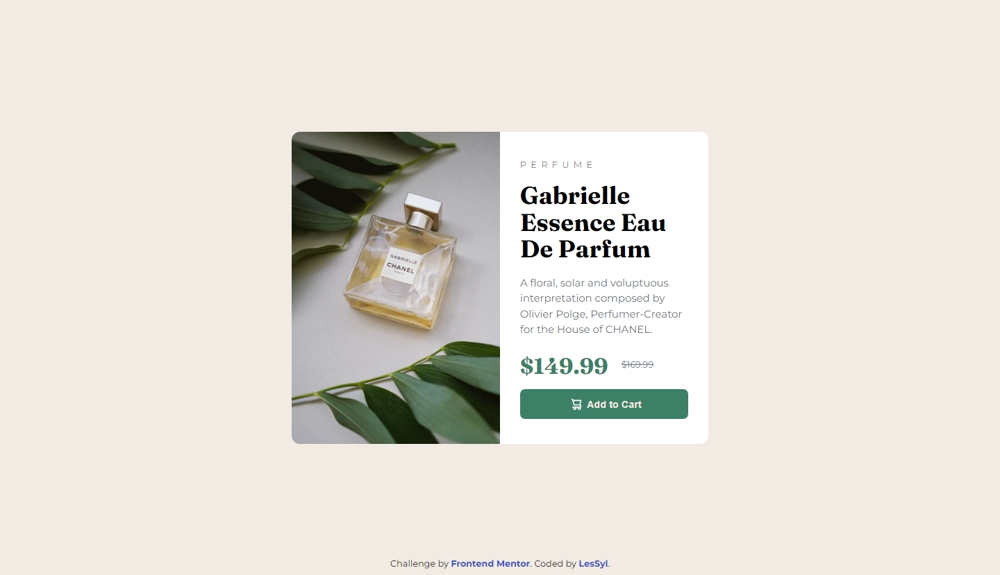

# Frontend Mentor - Product preview card component solution

This is a solution to the [Product preview card component challenge on Frontend Mentor](https://www.frontendmentor.io/challenges/product-preview-card-component-GO7UmttRfa). Frontend Mentor challenges help you improve your coding skills by building realistic projects. 

## Table of contents

- [Overview](#overview)
  - [Screenshot](#screenshot)
  - [Links](#links)
- [My process](#my-process)
  - [Built with](#built-with)
  - [What I learned](#what-i-learned)
- [Author](#author)

## Overview

### Screenshot
Desktop

Mobile

### Links

- Repository URL:[https://github.com/LesSyl/product-preview-card-component](https://github.com/LesSyl/product-preview-card-component)
- Solution URL:
- Live Site URL:[https://lessyl.github.io/product-preview-card-component/](https://lessyl.github.io/product-preview-card-component/)

## My process

### Built with

- Mobile-first workflow
- Sass
- BEM
- Flexbox
- Kit

### What I learned

A simple project, where I practised how to build responsive cards. The biggest challenge for me was adding an icon to the button.

## Author

- Frontend Mentor - [@LesSyl](https://www.frontendmentor.io/profile/LesSyl)
- gitHub - [@LesSyl](https://github.com/LesSyl)